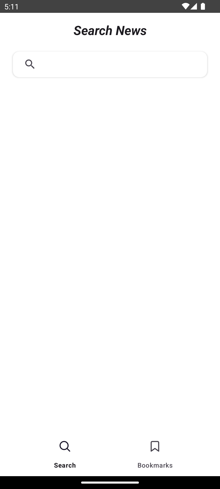
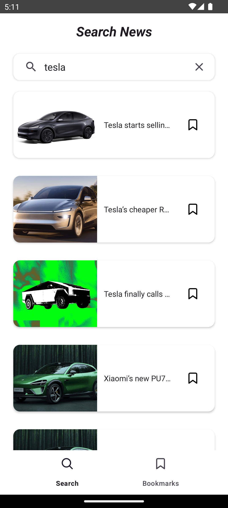
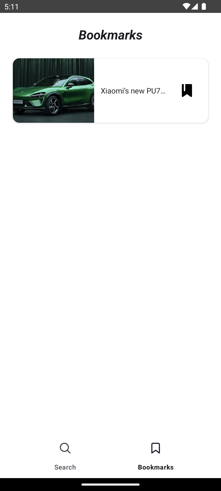

# 📰 News App

A News Application built with **Kotlin** and **XML layouts**.  
It fetches real-time news using the **News API**.

| Home Screen | Search | Article Detail | Bookmarks |
|-------------|--------|----------------|-----------|
|  |  |  |  |

## ✨ Features
1. **Search News** – Search for any topic with a SearchView.
2. **Article Details Screen** - Read News with details (author, publication time, etc.)
3. **Bookmarks Screen** – Save and manage your favorite articles.
4. **Open in Browser** – Open articles directly via an external browser.

## 🛠 Tech Stack
- Kotlin
- XML (UI Layouts)
- Retrofit2 (Networking)
- Kotlin Flows (State Management)
- DiffUtil + AsyncListDiffer (RecyclerView optimization)
- Navigation Component (Screen navigation)
- Glide (Image loading)

## 📡 API
- [NewsAPI.org](https://newsapi.org/)

## 🚀 How to Run
1. Clone the project.
2. Build and run the app on Android Studio.
